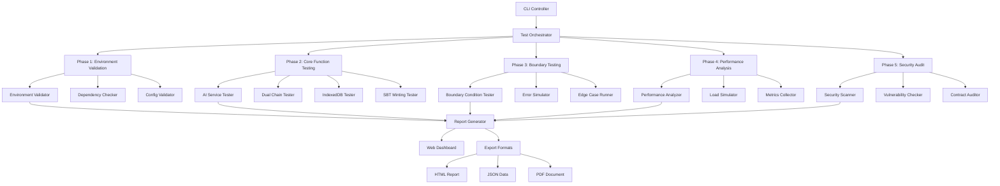
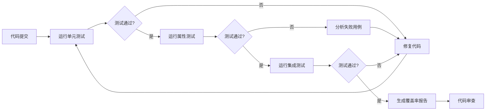

# Design Document: Pre-Launch Debugging System

## Overview

证道项目上线前调试系统是一个全面的测试和验证框架，旨在确保基于双链（BNB Chain和Solana）的SBT成就系统在生产环境中的稳定性、安全性和性能。该系统采用五阶段测试方法论，通过自动化测试脚本、验证工具和报告生成器，系统化地识别和解决潜在问题。

设计核心理念：
- **分层验证**: 从环境配置到安全审计的渐进式验证
- **自动化优先**: 最大化自动化测试覆盖率，减少人工干预
- **可追溯性**: 每个测试项都映射到具体的需求和风险点
- **可重复性**: 所有测试都可以在不同环境中重复执行
- **可观测性**: 详细的日志、报告和可视化仪表板

## Architecture

### 系统架构



### 五阶段测试流程

1. **Phase 1: 环境配置验证**
   - 验证环境变量完整性和有效性
   - 检查依赖包版本和兼容性
   - 测试外部服务连接性（AI APIs、RPC节点）
   - 验证构建配置和编译成功

2. **Phase 2: 核心功能测试**
   - AI服务降级机制测试
   - 双链操作并发测试
   - IndexedDB CRUD操作测试
   - SBT铸造流程测试
   - 打卡和复盘功能测试

3. **Phase 3: 边界条件测试**
   - 极端输入值测试
   - 网络故障模拟
   - 存储配额限制测试
   - 时区边界测试
   - 错误恢复机制测试

4. **Phase 4: 性能优化**
   - 页面加载性能测试
   - API响应时间测试
   - 并发用户负载测试
   - 数据库操作性能测试
   - 内存和CPU使用分析

5. **Phase 5: 安全审计**
   - 输入验证和XSS防护
   - 智能合约安全审计
   - 私钥和敏感数据保护
   - CORS和CSP配置验证
   - 依赖包漏洞扫描

## Components and Interfaces

### 1. Test Orchestrator

**职责**: 协调所有测试阶段的执行，管理测试生命周期

**接口**:
```typescript
interface TestOrchestrator {
  // 执行完整测试套件
  runFullSuite(config: TestConfig): Promise<TestSuiteResult>
  
  // 执行特定阶段
  runPhase(phase: TestPhase): Promise<PhaseResult>
  
  // 执行特定测试
  runTest(testId: string): Promise<TestResult>
  
  // 获取测试状态
  getStatus(): TestStatus
  
  // 停止测试执行
  stop(): Promise<void>
}

interface TestConfig {
  phases: TestPhase[]
  parallel: boolean
  timeout: number
  retryCount: number
  reportFormat: ReportFormat[]
}

type TestPhase = 'environment' | 'function' | 'boundary' | 'performance' | 'security'
type ReportFormat = 'html' | 'json' | 'pdf'
```

### 2. Environment Validator

**职责**: 验证环境配置的完整性和正确性

**接口**:
```typescript
interface EnvironmentValidator {
  // 验证所有环境变量
  validateEnvVars(): Promise<EnvValidationResult>
  
  // 验证特定环境变量
  validateEnvVar(name: string, validator: (value: string) => boolean): ValidationResult
  
  // 验证API连接性
  validateAPIConnectivity(service: AIService): Promise<ConnectivityResult>
  
  // 验证区块链RPC
  validateRPCEndpoint(chain: 'bnb' | 'solana'): Promise<RPCValidationResult>
  
  // 验证依赖包
  validateDependencies(): Promise<DependencyResult>
}

interface EnvValidationResult {
  passed: boolean
  missing: string[]
  invalid: Array<{name: string, reason: string}>
  warnings: string[]
}
```

### 3. AI Service Tester

**职责**: 测试AI服务的可用性和降级机制

**接口**:
```typescript
interface AIServiceTester {
  // 测试单个AI服务
  testService(service: AIService): Promise<ServiceTestResult>
  
  // 测试降级链
  testFallbackChain(): Promise<FallbackTestResult>
  
  // 模拟服务故障
  simulateFailure(service: AIService): Promise<FailureSimulationResult>
  
  // 测试响应质量
  testResponseQuality(samples: ReviewData[]): Promise<QualityMetrics>
  
  // 测试响应时间
  measureLatency(service: AIService, iterations: number): Promise<LatencyMetrics>
}

type AIService = 'glm4' | 'minimax' | 'deepseek' | 'gemini'

interface FallbackTestResult {
  chain: AIService[]
  transitions: Array<{from: AIService, to: AIService, latency: number}>
  gracefulDegradation: boolean
}
```

### 4. Dual Chain Tester

**职责**: 测试双链操作的并发安全性和一致性

**接口**:
```typescript
interface DualChainTester {
  // 测试并发交易
  testConcurrentTransactions(count: number): Promise<ConcurrencyTestResult>
  
  // 测试竞态条件
  testRaceConditions(): Promise<RaceConditionResult>
  
  // 测试链切换
  testChainSwitching(): Promise<ChainSwitchResult>
  
  // 验证状态一致性
  verifyStateConsistency(): Promise<ConsistencyResult>
  
  // 测试交易锁机制
  testTransactionLocking(): Promise<LockingTestResult>
}

interface ConcurrencyTestResult {
  totalTests: number
  passed: number
  failed: number
  raceConditionsDetected: number
  conflicts: Array<{chain: string, txHash: string, error: string}>
}
```

### 5. IndexedDB Tester

**职责**: 测试IndexedDB的数据操作和迁移逻辑

**接口**:
```typescript
interface IndexedDBTester {
  // 测试CRUD操作
  testCRUDOperations(): Promise<CRUDTestResult>
  
  // 测试版本迁移
  testMigration(fromVersion: number, toVersion: number): Promise<MigrationTestResult>
  
  // 测试数据完整性
  verifyDataIntegrity(): Promise<IntegrityResult>
  
  // 测试配额限制
  testQuotaLimits(): Promise<QuotaTestResult>
  
  // 测试并发访问
  testConcurrentAccess(operations: number): Promise<ConcurrencyResult>
}

interface MigrationTestResult {
  success: boolean
  dataPreserved: boolean
  recordsBeforeMigration: number
  recordsAfterMigration: number
  checksumMatch: boolean
  rollbackTested: boolean
}
```

### 6. SBT Minting Tester

**职责**: 测试SBT铸造流程和重复防护

**接口**:
```typescript
interface SBTMintingTester {
  // 测试铸造流程
  testMintingFlow(level: AchievementLevel): Promise<MintingTestResult>
  
  // 测试重复防护
  testDuplicatePrevention(): Promise<DuplicateTestResult>
  
  // 测试跨链一致性
  testCrossChainConsistency(): Promise<CrossChainResult>
  
  // 验证链上状态
  verifyOnChainState(address: string): Promise<OnChainStateResult>
  
  // 测试待处理交易处理
  testPendingTransactionHandling(): Promise<PendingTxResult>
}

type AchievementLevel = 1 | 2 | 3 | 4 | 5 | 6

interface DuplicateTestResult {
  level: AchievementLevel
  firstMintSuccess: boolean
  secondMintBlocked: boolean
  errorMessageCorrect: boolean
  stateConsistent: boolean
}
```

### 7. Boundary Tester

**职责**: 测试边界条件和错误场景

**接口**:
```typescript
interface BoundaryTester {
  // 测试空输入
  testEmptyInputs(): Promise<EmptyInputTestResult>
  
  // 测试最大值
  testMaximumValues(): Promise<MaxValueTestResult>
  
  // 测试网络故障
  testNetworkFailures(): Promise<NetworkFailureResult>
  
  // 测试时区边界
  testTimezoneBoundaries(): Promise<TimezoneTestResult>
  
  // 测试错误恢复
  testErrorRecovery(errorType: ErrorType): Promise<RecoveryTestResult>
}

type ErrorType = 'network' | 'blockchain' | 'database' | 'ai_service' | 'validation'

interface TimezoneTestResult {
  boundaryTests: Array<{
    timezone: string
    localTime: string
    checkInAllowed: boolean
    streakCalculationCorrect: boolean
  }>
  dstTransitionHandled: boolean
}
```

### 8. Performance Analyzer

**职责**: 分析系统性能并生成性能报告

**接口**:
```typescript
interface PerformanceAnalyzer {
  // 测试页面加载性能
  measurePageLoad(url: string): Promise<PageLoadMetrics>
  
  // 测试API响应时间
  measureAPILatency(endpoint: string, iterations: number): Promise<LatencyMetrics>
  
  // 模拟负载测试
  runLoadTest(config: LoadTestConfig): Promise<LoadTestResult>
  
  // 分析数据库性能
  analyzeDBPerformance(): Promise<DBPerformanceMetrics>
  
  // 生成性能报告
  generateReport(): Promise<PerformanceReport>
}

interface PageLoadMetrics {
  ttfb: number // Time to First Byte
  fcp: number  // First Contentful Paint
  lcp: number  // Largest Contentful Paint
  tti: number  // Time to Interactive
  cls: number  // Cumulative Layout Shift
}

interface LatencyMetrics {
  p50: number
  p95: number
  p99: number
  mean: number
  min: number
  max: number
}

interface LoadTestConfig {
  concurrentUsers: number
  duration: number
  rampUpTime: number
  scenarios: LoadScenario[]
}
```

### 9. Security Auditor

**职责**: 执行安全审计并识别漏洞

**接口**:
```typescript
interface SecurityAuditor {
  // 审计API端点
  auditAPIEndpoints(): Promise<APISecurityResult>
  
  // 测试输入验证
  testInputValidation(): Promise<InputValidationResult>
  
  // 审计智能合约
  auditSmartContracts(): Promise<ContractAuditResult>
  
  // 检查私钥处理
  auditPrivateKeyHandling(): Promise<PrivateKeyAuditResult>
  
  // 扫描依赖漏洞
  scanDependencies(): Promise<DependencyVulnerabilityResult>
  
  // 生成安全报告
  generateSecurityReport(): Promise<SecurityReport>
}

interface SecurityReport {
  critical: SecurityIssue[]
  high: SecurityIssue[]
  medium: SecurityIssue[]
  low: SecurityIssue[]
  recommendations: string[]
  overallRiskScore: number
}

interface SecurityIssue {
  id: string
  title: string
  description: string
  severity: 'critical' | 'high' | 'medium' | 'low'
  location: string
  remediation: string
}
```

### 10. Report Generator

**职责**: 生成测试报告和可视化仪表板

**接口**:
```typescript
interface ReportGenerator {
  // 生成HTML报告
  generateHTMLReport(results: TestSuiteResult): Promise<string>
  
  // 生成JSON数据
  generateJSONReport(results: TestSuiteResult): Promise<object>
  
  // 生成PDF文档
  generatePDFReport(results: TestSuiteResult): Promise<Buffer>
  
  // 生成趋势分析
  generateTrendAnalysis(historicalResults: TestSuiteResult[]): Promise<TrendReport>
  
  // 创建仪表板
  createDashboard(results: TestSuiteResult): Promise<Dashboard>
}

interface TestSuiteResult {
  timestamp: Date
  duration: number
  phases: PhaseResult[]
  summary: TestSummary
  coverage: CoverageMetrics
}

interface TestSummary {
  total: number
  passed: number
  failed: number
  skipped: number
  passRate: number
}
```

## Data Models

### Test Configuration

```typescript
interface TestConfiguration {
  id: string
  name: string
  description: string
  phases: PhaseConfiguration[]
  globalTimeout: number
  retryPolicy: RetryPolicy
  notifications: NotificationConfig
  reporting: ReportingConfig
}

interface PhaseConfiguration {
  phase: TestPhase
  enabled: boolean
  tests: TestDefinition[]
  timeout: number
  continueOnFailure: boolean
}

interface TestDefinition {
  id: string
  name: string
  description: string
  category: string
  priority: 'critical' | 'high' | 'medium' | 'low'
  timeout: number
  retryCount: number
  dependencies: string[]
  parameters: Record<string, any>
}
```

### Test Results

```typescript
interface TestResult {
  testId: string
  testName: string
  status: 'passed' | 'failed' | 'skipped' | 'error'
  startTime: Date
  endTime: Date
  duration: number
  error?: TestError
  logs: LogEntry[]
  screenshots: Screenshot[]
  metrics: Record<string, number>
}

interface TestError {
  message: string
  stack: string
  code: string
  details: Record<string, any>
}

interface LogEntry {
  timestamp: Date
  level: 'debug' | 'info' | 'warn' | 'error'
  message: string
  context: Record<string, any>
}
```

### Validation Results

```typescript
interface ValidationResult {
  valid: boolean
  errors: ValidationError[]
  warnings: ValidationWarning[]
  metadata: Record<string, any>
}

interface ValidationError {
  field: string
  message: string
  code: string
  severity: 'error' | 'critical'
}

interface ValidationWarning {
  field: string
  message: string
  suggestion: string
}
```

### Performance Metrics

```typescript
interface PerformanceMetrics {
  timestamp: Date
  category: 'page_load' | 'api' | 'database' | 'blockchain'
  metrics: {
    latency: LatencyMetrics
    throughput: number
    errorRate: number
    resourceUsage: ResourceUsage
  }
}

interface ResourceUsage {
  cpu: number
  memory: number
  network: NetworkUsage
}

interface NetworkUsage {
  bytesReceived: number
  bytesSent: number
  requestCount: number
}
```

### Security Audit Results

```typescript
interface SecurityAuditResult {
  timestamp: Date
  scope: string[]
  issues: SecurityIssue[]
  compliance: ComplianceCheck[]
  recommendations: SecurityRecommendation[]
  riskAssessment: RiskAssessment
}

interface ComplianceCheck {
  standard: string
  requirement: string
  status: 'compliant' | 'non_compliant' | 'partial'
  evidence: string
}

interface RiskAssessment {
  overallRisk: 'low' | 'medium' | 'high' | 'critical'
  categories: Record<string, number>
  mitigationPriority: string[]
}
```

## Correctness Properties

属性（Property）是关于系统行为的特征或规则，应该在所有有效执行中保持为真。属性是人类可读规范和机器可验证正确性保证之间的桥梁。通过基于属性的测试，我们可以验证系统在大量生成的输入下的正确性。

### Property 1: 环境验证完整性

*对于任何*环境配置，当执行环境验证时，验证器应该识别所有缺失或无效的环境变量，并生成包含具体变量名和预期格式的详细报告。

**Validates: Requirements 1.1, 1.6, 1.7**

### Property 2: AI服务降级链完整性

*对于任何*AI服务故障场景，系统应该按照 GLM-4 → MiniMax → DeepSeek → Gemini 的顺序自动降级，且每次降级的延迟应小于3秒。

**Validates: Requirements 2.1, 2.2, 2.5**

### Property 3: AI服务恢复后重用

*对于任何*从故障中恢复的AI服务，系统应该能够检测到恢复并重新使用该服务进行后续请求。

**Validates: Requirements 2.4**

### Property 4: 双链并发操作互斥性

*对于任何*同一成就等级的SBT铸造请求，当在BNB Chain和Solana上同时发起时，系统应该确保只有一条链完成铸造，另一条链的请求被拒绝。

**Validates: Requirements 3.2**

### Property 5: 双链操作无竞态条件

*对于任何*并发的双链操作集合，系统应该通过适当的锁机制防止竞态条件，确保钱包状态和交易状态的一致性。

**Validates: Requirements 3.1, 3.4**

### Property 6: 链切换时状态一致性

*对于任何*进行中的交易，当用户切换区块链网络时，系统应该正确维护交易状态，不会导致状态丢失或不一致。

**Validates: Requirements 3.3**

### Property 7: 数据库迁移数据完整性

*对于任何*数据库版本迁移，所有现有的打卡记录和复盘数据应该被完整保留，迁移前后的数据校验和应该匹配。

**Validates: Requirements 4.2, 4.6**

### Property 8: 数据库迁移成功执行

*对于任何*从历史版本到当前版本的数据库迁移，迁移脚本应该成功执行，不会导致数据损坏或丢失。

**Validates: Requirements 4.1, 4.5**

### Property 9: 数据库迁移失败回滚

*对于任何*失败的数据库迁移，回滚机制应该将数据库恢复到迁移前的状态，确保数据完整性。

**Validates: Requirements 4.3**

### Property 10: SBT重复铸造防护

*对于任何*已经铸造过SBT的成就等级，后续的铸造尝试应该被系统拒绝，无论是在BNB Chain还是Solana上。

**Validates: Requirements 5.1, 5.2**

### Property 11: 链上与本地状态一致性

*对于任何*用户的SBT铸造记录，链上的记录应该与本地IndexedDB中的记录保持一致。

**Validates: Requirements 5.3**

### Property 12: 待处理交易锁定

*对于任何*正在pending的SBT铸造交易，系统应该阻止对同一成就等级的后续铸造尝试，直到交易完成或失败。

**Validates: Requirements 5.4**

### Property 13: 时区转换正确性

*对于任何*时区的打卡操作，系统应该正确地将本地时间转换为UTC存储，并在显示时转换回用户的本地时区。

**Validates: Requirements 6.1, 6.2**

### Property 14: 跨时区连续打卡计算

*对于任何*跨时区的打卡序列，系统应该基于用户的本地日期正确计算连续打卡天数，不受时区变化影响。

**Validates: Requirements 6.3, 6.4**

### Property 15: 图片验证三层执行顺序

*对于任何*上传的图片，系统应该按照客户端验证 → 服务器端验证 → AI内容审核的顺序执行，任何一层失败都应该返回适当的错误消息。

**Validates: Requirements 7.1, 7.2, 7.3, 7.4**

### Property 16: 图片验证成功后存储

*对于任何*通过三层验证的图片，系统应该将其正确存储到IndexedDB中，并可以完整检索。

**Validates: Requirements 7.6**

### Property 17: 成就等级转换正确性

*对于任何*成就等级（1-6），系统应该正确处理等级转换逻辑，确保用户按顺序解锁成就。

**Validates: Requirements 8.1**

### Property 18: AI复盘多提供商兼容性

*对于任何*配置的AI服务提供商，系统应该能够使用该提供商生成复盘分析，输出格式应该一致。

**Validates: Requirements 8.3, 14.6**

### Property 19: 打卡数据往返一致性

*对于任何*打卡记录，存储到IndexedDB后再检索出来，数据应该保持完整和一致。

**Validates: Requirements 8.4**

### Property 20: 空输入验证

*对于任何*接受用户输入的字段，当提供空值时，系统应该返回适当的验证错误消息。

**Validates: Requirements 9.1**

### Property 21: 最大值处理

*对于任何*数值字段，当提供最大允许值时，系统应该正确处理而不会发生溢出或错误。

**Validates: Requirements 9.2**

### Property 22: 离线功能和同步

*对于任何*网络断开的场景，系统应该提供离线功能，并在网络恢复后正确同步数据。

**Validates: Requirements 9.3**

### Property 23: 区块链交易失败处理

*对于任何*失败的区块链交易，系统应该正确处理错误并向用户显示清晰的错误消息。

**Validates: Requirements 9.4**

### Property 24: 畸形API响应处理

*对于任何*畸形或意外的API响应，系统应该正确解析错误并优雅地恢复，不会导致崩溃。

**Validates: Requirements 9.6**

### Property 25: 页面加载性能

*对于任何*页面加载请求，初始加载时间应该在3秒内完成。

**Validates: Requirements 10.1**

### Property 26: AI响应性能

*对于任何*AI复盘生成请求，响应时间应该在10秒内完成。

**Validates: Requirements 10.2**

### Property 27: 区块链交易确认性能

*对于任何*区块链交易，平均确认时间应该在30秒内完成。

**Validates: Requirements 10.3**

### Property 28: 数据库操作性能

*对于任何*IndexedDB的读写操作，延迟应该在100毫秒内完成。

**Validates: Requirements 10.4**

### Property 29: 性能报告包含百分位指标

*对于任何*性能测试，生成的报告应该包含p50、p95、p99百分位指标。

**Validates: Requirements 10.6**

### Property 30: API端点认证保护

*对于任何*API端点，未经认证的访问尝试应该被拒绝并返回适当的错误。

**Validates: Requirements 11.1**

### Property 31: XSS和注入攻击防护

*对于任何*用户输入，系统应该正确验证和清理，防止XSS和注入攻击。

**Validates: Requirements 11.2**

### Property 32: 智能合约安全性

*对于任何*智能合约，不应该存在重入攻击或整数溢出漏洞。

**Validates: Requirements 11.3**

### Property 33: 私钥安全处理

*对于任何*私钥操作，私钥不应该出现在日志、客户端代码或版本控制中。

**Validates: Requirements 11.4, 11.5**

### Property 34: CORS配置正确性

*对于任何*跨域请求，只有白名单中的源应该被允许访问。

**Validates: Requirements 11.6**

### Property 35: 安全报告生成

*对于任何*安全审计，系统应该生成包含风险评级的详细安全报告。

**Validates: Requirements 11.7**

### Property 36: 测试自动化执行

*对于任何*测试套件执行，所有测试应该自动运行，无需人工干预。

**Validates: Requirements 12.1**

### Property 37: 测试报告完整性

*对于任何*测试执行，系统应该生成包含通过/失败状态、执行时间、覆盖率指标的综合报告，并支持HTML、JSON、PDF多种格式导出。

**Validates: Requirements 12.2, 12.4, 12.5**

### Property 38: 测试失败调试信息捕获

*对于任何*失败的测试，系统应该捕获截图、日志和堆栈跟踪以便调试。

**Validates: Requirements 12.3**

### Property 39: 关键测试失败通知

*对于任何*关键测试失败，系统应该通过配置的渠道发送通知。

**Validates: Requirements 12.6**

### Property 40: 测试历史数据维护

*对于任何*测试执行，系统应该保存历史结果以便进行趋势分析。

**Validates: Requirements 12.7**

### Property 41: TODO项识别和分类

*对于任何*代码库扫描，系统应该识别所有TODO注释，并按优先级和模块分类，生成完成度报告。

**Validates: Requirements 13.1, 13.2, 13.4**

### Property 42: TODO完成度验证

*对于任何*TODO项，系统应该验证其已被解决或有跟踪问题，关键TODO未解决时应标记为阻塞问题。

**Validates: Requirements 13.3, 13.5**

### Property 43: 生产就绪判断

*对于任何*代码库，当所有关键TODO都已解决时，系统应该标记代码库为生产就绪状态。

**Validates: Requirements 13.6**

### Property 44: AI输入格式正确性

*对于任何*发送给AI服务的打卡数据，上下文应该被正确格式化并包含完整信息。

**Validates: Requirements 14.2**

### Property 45: AI情感分析准确性

*对于任何*有标注数据的情感分析测试，准确率应该高于80%。

**Validates: Requirements 14.5**

### Property 46: AI分析降级机制

*对于任何*AI分析失败的场景，系统应该降级到更简单的统计分析方法。

**Validates: Requirements 14.7**

### Property 47: 最终检查清单验证

*对于任何*最终检查清单执行，系统应该验证所有前置测试阶段都已通过。

**Validates: Requirements 15.1**

### Property 48: 监控配置验证

*对于任何*监控系统检查，日志记录、错误跟踪和分析工具应该被正确配置。

**Validates: Requirements 15.3**

### Property 49: 备份和恢复机制验证

*对于任何*备份测试，数据库备份和恢复机制应该被成功执行和验证。

**Validates: Requirements 15.4**

### Property 50: 回滚计划验证

*对于任何*回滚计划检查，回滚程序应该被文档化并通过测试验证。

**Validates: Requirements 15.5**

### Property 51: 部署决策生成

*对于任何*最终检查清单，系统应该基于所有检查项生成go/no-go建议，全部通过时创建带时间戳和验证者签名的部署审批记录。

**Validates: Requirements 15.6, 15.7**

## Error Handling

### 错误分类

系统将错误分为以下几类，每类都有特定的处理策略：

1. **环境配置错误**
   - 缺失的环境变量
   - 无效的API密钥
   - 不可访问的RPC端点
   - 处理策略：立即失败，生成详细的错误报告，指导用户修复配置

2. **网络错误**
   - API请求超时
   - 连接失败
   - DNS解析失败
   - 处理策略：重试机制（指数退避），降级到备用服务，记录详细日志

3. **区块链错误**
   - 交易失败
   - Gas估算错误
   - 合约调用失败
   - 处理策略：向用户显示清晰的错误消息，提供重试选项，记录链上错误详情

4. **数据库错误**
   - 存储配额超限
   - 数据损坏
   - 迁移失败
   - 处理策略：尝试回滚，清理旧数据，向用户提示存储问题

5. **验证错误**
   - 输入格式错误
   - 文件类型不支持
   - 数据完整性检查失败
   - 处理策略：返回具体的验证错误消息，指导用户修正输入

6. **AI服务错误**
   - API限流
   - 服务不可用
   - 响应格式错误
   - 处理策略：自动降级到下一个AI提供商，记录降级事件

### 错误恢复策略

```typescript
interface ErrorRecoveryStrategy {
  // 重试策略
  retry: {
    maxAttempts: number
    backoffMultiplier: number
    initialDelay: number
  }
  
  // 降级策略
  fallback: {
    enabled: boolean
    fallbackChain: string[]
    fallbackTimeout: number
  }
  
  // 回滚策略
  rollback: {
    enabled: boolean
    checkpointInterval: number
    maxRollbackDepth: number
  }
  
  // 通知策略
  notification: {
    criticalErrors: boolean
    channels: NotificationChannel[]
    throttle: number
  }
}

type NotificationChannel = 'email' | 'slack' | 'webhook' | 'console'
```

### 错误日志记录

所有错误都应该被详细记录，包含以下信息：

- 错误时间戳
- 错误类型和严重程度
- 错误消息和堆栈跟踪
- 上下文信息（用户操作、系统状态）
- 恢复尝试和结果

### 用户友好的错误消息

错误消息应该：
- 使用清晰、非技术性的语言
- 说明发生了什么问题
- 提供可能的解决方案
- 包含支持联系方式（如适用）

示例：
```
❌ 打卡失败
原因：网络连接不稳定
建议：请检查您的网络连接后重试
如果问题持续，请联系技术支持
```

## Testing Strategy

### 测试方法论

证道项目采用**双重测试策略**，结合单元测试和基于属性的测试（Property-Based Testing, PBT）：

1. **单元测试（Unit Tests）**
   - 用途：验证特定示例、边界情况和错误条件
   - 工具：Jest + React Testing Library
   - 覆盖范围：具体的功能点、集成点、已知的边界情况
   - 平衡原则：避免过多单元测试，让属性测试处理大量输入覆盖

2. **基于属性的测试（Property-Based Tests）**
   - 用途：验证跨所有输入的通用属性
   - 工具：fast-check (JavaScript/TypeScript的PBT库)
   - 配置：每个属性测试最少100次迭代
   - 标记格式：`// Feature: pre-launch-debugging, Property N: [property text]`
   - 覆盖范围：通用规则、不变量、往返属性、幂等性

### 测试工具栈

```typescript
// 测试框架和工具
const testingStack = {
  unitTesting: {
    framework: 'Jest',
    uiTesting: 'React Testing Library',
    coverage: 'Istanbul/NYC'
  },
  
  propertyTesting: {
    library: 'fast-check',
    iterations: 100, // 最少迭代次数
    seed: 'random' // 可固定用于复现
  },
  
  e2eTesting: {
    framework: 'Playwright',
    browsers: ['chromium', 'firefox', 'webkit']
  },
  
  performanceTesting: {
    tool: 'Lighthouse CI',
    metrics: ['FCP', 'LCP', 'TTI', 'CLS']
  },
  
  securityTesting: {
    staticAnalysis: 'ESLint + security plugins',
    dependencyScanning: 'npm audit + Snyk',
    contractAudit: 'Slither (Solidity) + Anchor test (Rust)'
  },
  
  blockchainTesting: {
    bnbChain: 'Hardhat + Waffle',
    solana: 'Anchor Test Framework',
    localNodes: 'Ganache (BNB) + Solana Test Validator'
  }
}
```

### 测试环境配置

```typescript
interface TestEnvironment {
  // 本地测试环境
  local: {
    database: 'IndexedDB (fake-indexeddb for Node.js)',
    blockchain: {
      bnb: 'Hardhat Network',
      solana: 'Solana Test Validator'
    },
    aiServices: 'Mock AI responses'
  }
  
  // 测试网环境
  testnet: {
    blockchain: {
      bnb: 'BSC Testnet',
      solana: 'Solana Devnet'
    },
    aiServices: 'Real AI APIs with test keys'
  }
  
  // 集成测试环境
  integration: {
    database: 'Real IndexedDB in browser',
    blockchain: 'Testnet',
    aiServices: 'Real AI APIs'
  }
}
```

### 测试覆盖率目标

- **代码覆盖率**: 最低80%，核心模块90%+
- **分支覆盖率**: 最低75%
- **属性测试覆盖**: 所有设计文档中的属性都应有对应的PBT测试
- **边界情况覆盖**: 所有已识别的边界情况都应有测试

### 测试执行流程



### 持续集成配置

```yaml
# CI/CD Pipeline 示例
name: Pre-Launch Testing

on: [push, pull_request]

jobs:
  unit-tests:
    runs-on: ubuntu-latest
    steps:
      - uses: actions/checkout@v3
      - name: Install dependencies
        run: npm ci
      - name: Run unit tests
        run: npm run test:unit
      - name: Upload coverage
        uses: codecov/codecov-action@v3
  
  property-tests:
    runs-on: ubuntu-latest
    steps:
      - uses: actions/checkout@v3
      - name: Install dependencies
        run: npm ci
      - name: Run property-based tests
        run: npm run test:property
        env:
          FAST_CHECK_ITERATIONS: 100
  
  integration-tests:
    runs-on: ubuntu-latest
    steps:
      - uses: actions/checkout@v3
      - name: Install dependencies
        run: npm ci
      - name: Start local blockchain nodes
        run: |
          npm run blockchain:start:bnb &
          npm run blockchain:start:solana &
      - name: Run integration tests
        run: npm run test:integration
  
  security-audit:
    runs-on: ubuntu-latest
    steps:
      - uses: actions/checkout@v3
      - name: Run npm audit
        run: npm audit --audit-level=moderate
      - name: Run Snyk scan
        uses: snyk/actions/node@master
        env:
          SNYK_TOKEN: ${{ secrets.SNYK_TOKEN }}
  
  performance-tests:
    runs-on: ubuntu-latest
    steps:
      - uses: actions/checkout@v3
      - name: Build application
        run: npm run build
      - name: Run Lighthouse CI
        uses: treosh/lighthouse-ci-action@v9
        with:
          urls: |
            http://localhost:3000
          uploadArtifacts: true
```

### 测试数据生成策略

对于基于属性的测试，使用fast-check的生成器：

```typescript
import * as fc from 'fast-check'

// 生成随机的打卡记录
const checkInRecordArbitrary = fc.record({
  id: fc.uuid(),
  userId: fc.uuid(),
  timestamp: fc.date(),
  reflection: fc.string({ minLength: 10, maxLength: 500 }),
  mood: fc.integer({ min: 1, max: 5 }),
  tags: fc.array(fc.string(), { maxLength: 5 }),
  imageUrl: fc.option(fc.webUrl())
})

// 生成随机的成就等级
const achievementLevelArbitrary = fc.integer({ min: 1, max: 6 })

// 生成随机的区块链地址
const addressArbitrary = fc.hexaString({ minLength: 40, maxLength: 40 })
  .map(hex => `0x${hex}`)

// 生成随机的时区
const timezoneArbitrary = fc.constantFrom(
  'America/New_York',
  'Europe/London',
  'Asia/Shanghai',
  'Asia/Tokyo',
  'Australia/Sydney'
)
```

### 测试报告和可视化

测试完成后，系统应生成：

1. **HTML报告**: 包含所有测试结果、覆盖率、失败详情
2. **JSON数据**: 用于程序化分析和趋势跟踪
3. **PDF文档**: 用于存档和分享
4. **仪表板**: 实时显示测试状态和历史趋势

报告应包含：
- 测试执行摘要（总数、通过、失败、跳过）
- 每个测试阶段的详细结果
- 性能指标和趋势图
- 安全问题列表和风险评级
- 覆盖率热力图
- 失败测试的截图和日志
- 建议的修复措施

